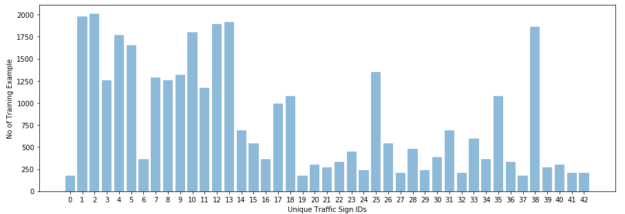
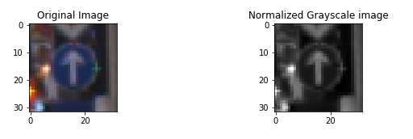
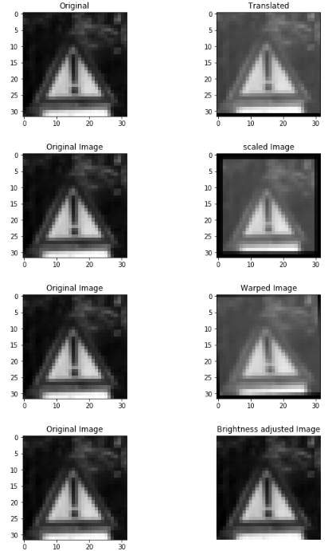
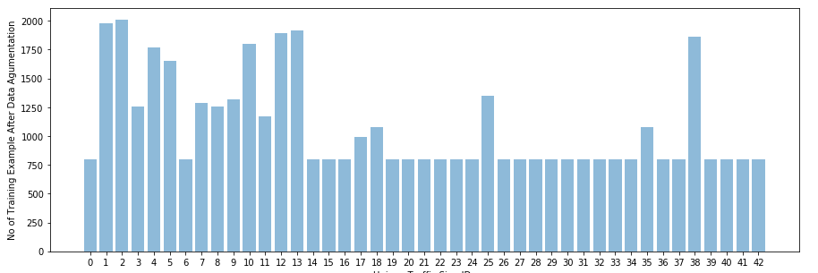
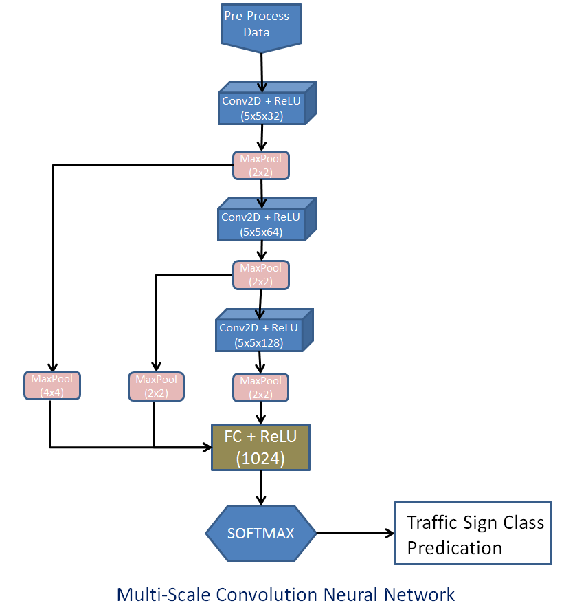
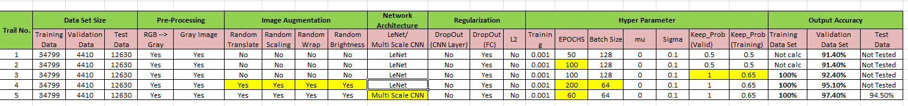
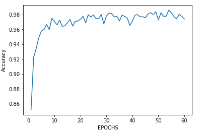
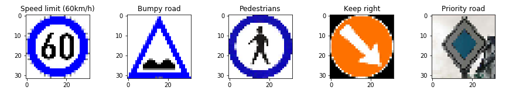
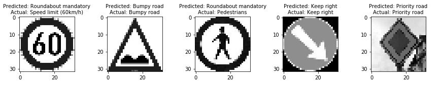

### Self-Driving Car Engineer Nanodegree
## Deep Learning

## Traffic Sign Recognition Classifier Project
### Build a Traffic Sign Recognition Project

The goals / steps of this project are the following:

1. Load the data set (see below for links to the project data set)
2. Explore, summarize and visualize the data set
3. Design, train and test a model architecture
4. Use the model to make predictions on new images
5. Analyze the softmax probabilities of the new images
6. Summarize the results with a written report

### Writeup / README

### Step-1 : Data Set Summary & Exploration :
#### Question1 : Provide a basic summary of the data set and identify where in your code the summary was done. In the code, the analysis should be done using python, numpy and/or pandas methods rather than hardcoding results manually.
#### Ans : 

1. Load the Data : The "traffic-signs-data.zip" contain 3 pickle files : train.p , valid.p, test.p . Loading the data set code is contain in the First code cell of the IPython notebook. 

2. Data Set Summary : The code for this step is contained in the second code cell of the IPython notebook. I used the pandas library to calculate summary statistics of the traffic signs data set:

    a) The size of training set is :34799
    
    b) The size of test set is : 12630
    
    c) The size of Validation set is : 4410
    
    d) The shape of a traffic sign image is : (32, 32, 3)
    
    e) The number of unique classes/labels in the data set is : 43
    

#### Question 2 : Include an exploratory visualization of the dataset and identify where the code is in your code file.
#### Ans :
The code for this step is contained in the third and Fourth code cell of the IPython notebook.

a) In Third Cell :Randomly visualize German Traffic Signs Training Dataset to see how data set image looks like.

b) In Fourth Cell: Visualize Training data set. Bar graph has created to see how training data is distributed. As you can see data is unevenly distributed.

### Step - 2 : Design and Test a Model Architecture

##### Question 1 :Describe how, and identify where in your code, you preprocessed the image data. What tecniques were chosen and why did you choose these techniques? Consider including images showing the output of each preprocessing technique. Pre-processing refers to techniques such as converting to grayscale, normalization, etc.

#### Ans :
The code for this step is contained in the sixth code cell of the IPython notebook.

As a first step, I decided to convert the images to grayscale because that increase the compute performance and also take less memory. 
Secondly I normalized the to achieve consistency in dynamic range for a set of data. This will also help in to train the model in range. 

Here is an example of a traffic sign image before and after gray scaling and normalization.

##### Question 2. Describe how, and identify where in your code, you set up training, validation and testing data. How much data was in each set? Explain what techniques were used to split the data into these sets. (OPTIONAL: As described in the "Stand Out Suggestions" part of the rubric, if you generated additional data for training, describe why you decided to generate additional data, how you generated the data, identify where in your code, and provide example images of the additional data)

#### Ans : 
After gray scale and normalization , I did the data set augmentation, because the amount of data is enough for network model to generalize well. Also as you can see the data is faily unbalanced and some classes are representation lower than the others. This all can be fixed by data augmentation. 

The code for data set augmentation is present in 7th code cell of the IPython notebook. 

I created 4 util function for dataset augmentation using the technique Geometric Image Transformations.
a) Random Image Translate

b) Random Image Scaling

c) Random Image wrap

d) Random Image Brightness

Used above function to generate additional data from existing training data. The advantage of above function that the dataset class will not change and it will balance the classes which are having lower representation.

The code for balancing the training data set is present in 8th code cell of the IPython notebook.

Below is histogram showing the after augumentation the training data set 

At the end, since Validation data size is very less in provided "valid.p". I splited 10% data from Training data set and added in validation data set. This will help in maintaining the approx. ratio of 60 (Training):20 (Validation):20(Test data) . 

The code for increasing the Validation data set is present in 11th code cell of the IPython notebook. At the below is the summary of data set which i used to train, valid  and test  the model

Updated Data set :

a) Training data set : 41832

b) Validation data set : 9058

c) Test data set : 12630 (No change)

Before feeding data to train the model and i shuffled the data so that model don't memorize the data input pattern.

#### Question 3. Describe, and identify where in your code, what your final model architecture looks like including model type, layers, layer sizes, connectivity, etc.) Consider including a diagram and/or table describing the final model.

#### Ans : 

First i tried with Lenet network on Augmented data and my validation accuracy was reached ~95%. Then i read some search on net to see what modification i can do in model to improve the performance. 

After some search and reading i found Multi-Scale Convolutional Network, which was present in paper [Pierre Sermanet / Yann LeCun paper](http://yann.lecun.com/exdb/publis/pdf/sermanet-ijcnn-11.pdf) is interesting and decided to implement this. This Architecture has 4 layers : 3 convolutional layers for feature extraction and one fully connected layer as a classifier.

The code of CNN model is present in 14th code cell of the IPython notebook.
Below is the Aritecture model of my network :

Lenet was strict Feed forward CNN and I used multi-scale CNN which means that conv2d layer output is not only forward to next later , but it also branched off and feed into classifier i.e. fully connected layer. These branched off layer undergo additional max-pooling, so that all convolutions are proportionally subsampled before going into classifier.

*** Regularization ***
I use the Dropout regularization on output/logits layer to minimize overfitting to training data

After all these changes (Data Augmentation + Mutiscale CNN + Dropout regularization) , I found my validation accuracy increased by ~3% and now it is closed to ~98%.

#### Question 4. Describe how, and identify where in your code, you trained your model. The discussion can include the type of optimizer, the batch size, number of epochs and any hyperparameters such as learning rate.

#### Ans : 
The code for training the model is located in the 18th code cell of the ipython notebook.
To train the model, I used Adam optimizer (already implemented in the LeNet lab). The final tuning of all hyperparameter are:

1. batch size: 64
2. epochs: 64
3. learning rate: 0.001
4. mu: 0
5. sigma: 0.1
7. Dropout keep probability: 0.65

#### Question 5. Describe the approach taken for finding a solution. Include in the discussion the results on the training, validation and test sets and where in the code these were calculated. Your approach may have been an iterative process, in which case, outline the steps you took to get to the final solution and why you chose those steps. Perhaps your solution involved an already well known implementation or architecture. In this case, discuss why you think the architecture is suitable for the current problem.

#### Ans :

Reaching to the current accuracy level is iterative process and lots of experiment done. Below is the detail :

***Selection of Convolution Neural networks : ***

In order to classify Traffic sign, I choose CNN because these are often used in image recognition systems with greater accuracy. 

The advantages are :

a)  Translation invariance : Different positions, same classification

b) Statistical invariance : When multiple input contain same kind of information weight can be share . Basically shares the parameter across spaces.

c) Creates convolution pyramid where all the spatial information has been squeezed out and only parameters that map to the contents of the image remains.

d) Takes advantage of pixel adjacency. The facts that pixels in an image are close together for a reason and have special meaning. Hence to take advantages of local structure characteristics , CNN learns to classify local patterns, like shapes and objects, in an image.

d) CNN will have several layers, and each layer capture a different level in the hierarchy of objects. The first layer is the lowest level in the hierarchy, where the CNN generally classifies small parts of the image into simple shapes like horizontal and vertical lines and simple blobs of colors. The subsequent layers tend to be higher levels in the hierarchy and generally classify more complex ideas like shapes (combinations of lines), and eventually full objects like Traffic sign. 

f) Increase the depth of your network layer after layer and once we have deep and narrow representation of feature connect the whole thing to a few regular fully connected layer and we are ready to train the classifier. 

Typical CNN architecture alternatively convolution and max pooling followed by few fully connected layer at the top.

*** Selection of Pooling layer : *** 

In order to improve the performance of CNN . In convolution, stride is aggressive way of down sampling and image and it removes lots of information. This can be improve by pooling which is form non-liner down-sampling. There are several non-linear functions to implement pooling. I choose max pooling which the most common.  It partitions the input image into a set of non-overlapping rectangles and, for each such sub-region, outputs the maximum. The advantages are :

a) More accurate

b)  Decrease the size of output (reduce the number of parameter for future layers) and prevent over fitting.

Disadvantages :

a) Since convolution runs at lower stride . this make model to become more expensive.

b) More hyper parameter to tune (pooling size and pooling stride

It is common to periodically insert a pooling layer between successive convolutional layers in a CNN architecture. The pooling operation provides a form of translation invariance.

***Selection of activation function : ***

Linear model are limited ,we can’t use more parameter. In order to introduce non-linearity, I choose the most commonly used non-liner activation function ReLU (rectified Liner units). The advantages are :

a) Improve the Parameter efficiency

b) Allows network to solve more complex problem/patterns. 

The other activation functions like sigmoid , hyperbolic tangent also introduce the non-linearity, but ReLU makes network training much faster without making significant differences to accuracy.

*** Selection of Regularization : ***

Deep network that are just right size of for data is very-very hard to optimize. So in practice, we always try networks that are way too big for our data and then we try our best to prevent them from overfitting. Regularization is a method by which we can prevent overfitting. There are several method like early termination, L2 regularization, dropout to solve this problem.

I don’t find any performance improvement in my network when I used L2 regularization, so I decided not to use (May be some other parameter (beta, learning rate, etc..) need to better tune ). 

So I decided to use dropout on the Fully connected later with keep_prob  = 0.65. Since a fully connected layer occupies most of the parameters, it is prone to overfitting. By using dropout I saw a performance improvement (~.5 %) on validation accuracy.

Below is my trail log (Though I forget to capture all in table) :

The code for calculating the accuracy of the model is located in the ninth cell of the Ipython notebook.

My final model results are:

a. Validation set accuracy of : ***97.4%***

b. Test set accuracy of : ***94.5%***

### Step - 3 : Test a Model on New Images
#### Question 1. Choose five German traffic signs found on the web and provide them in the report. For each image, discuss what quality or qualities might be difficult to classify.
#### Ans :

Here are five German traffic signs that I found on the web:

I think my sign images are clear and should not make classification difficult. My images appear to be more easily distinguishable than quite a few images from the original dataset. 

a) I noticed that my images specially first, second and third are bit brighter and might occupy a different range in the color space, possibly a range that the model was not trained on

b) Also on First and Third images have dark circle on outer of sign. The Network my confuse with other Roundabout sign. 

#### Question 2. Discuss the model's predictions on these new traffic signs and compare the results to predicting on the test set. Identify where in your code predictions were made. At a minimum, discuss what the predictions were, the accuracy on these new predictions, and compare the accuracy to the accuracy on the test set (OPTIONAL: Discuss the results in more detail as described in the "Stand Out Suggestions" part of the rubric).
#### Ans :

The code for making predictions on my final model is located in the 22nd code cell of the Ipython notebook.

Here are the results of the prediction:

Test Accuracy = ***60.0%*** 

As I guessed earlier, my model was not able to predict 1st and 3rd images correctly. The network is confused with "Roundabout mandatory (class id :40)" sign . We can solve this problem my adding similar kind of data set in traning/validation data set. 

The test data set accuracy was 94.5 % and accuracy on my images is 60% .  

#### Question 3. Describe how certain the model is when predicting on each of the five new images by looking at the softmax probabilities for each prediction and identify where in your code softmax probabilities were outputted. Provide the top 5 softmax probabilities for each image along with the sign type of each probability. (OPTIONAL: as described in the "Stand Out Suggestions" part of the rubric, visualizations can also be provided such as bar charts)

#### Ans :

The code for making predictions on my final model is located in the 24th cell of the Ipython notebook.

Below is the output :

***Image 1:(Speed limit (60km/h)) ***

Top 5 probabilites: [  9.74640489e-01   2.53551695e-02   4.27230134e-06   3.25634133e-08
   4.68785055e-09]
   
Top 5 indexes: [40 34 14  3 38]

*** Image 2:(Bumpy road) ***

Top 5 probabilites: [ 1.  0.  0.  0.  0.]

Top 5 indexes: [22  0  1  2  3]

*** Image 3:(Pedestrians) ***

Top 5 probabilites: [  1.00000000e+00   3.45818171e-20   3.30779611e-21   1.04122157e-21
   1.03542569e-23]

Top 5 indexes: [40 36 33 37 14]

*** Image 4:(Keep right) ***

Top 5 probabilites: [ 1.  0.  0.  0.  0.]

Top 5 indexes: [38  0  1  2  3]

*** Image 5:(Priority road) ***

Top 5 probabilites: [ 1.  0.  0.  0.  0.]

Top 5 indexes: [12  0  1  2  3]

a) The probability of 3 images (second, fourth and fifth) are 100% for actual Vs predicated output. No ambiguity

b) On Image 1 , the top 5 probability of classifier include the correct sign at 4 place. 

c) On Image 3, The top 5 probability even does not include the correct sign. the correct sign classified is out of top 5.
 

### Refection 
This is one of the first models I had a chance to build entirely from scratch, so i was pretty excited . There are lots of learning : 
a) How network can be designed
b) The importance of data set and pre-processing. 
c) How to tune hyper parameter 
d) Usage of regularization to avoid over fitting 

Though my model accuracy on my test images is not that good, but that's fine. I believe in coming lesson, I will learn more technique and concept to better fine tune and design the model.

